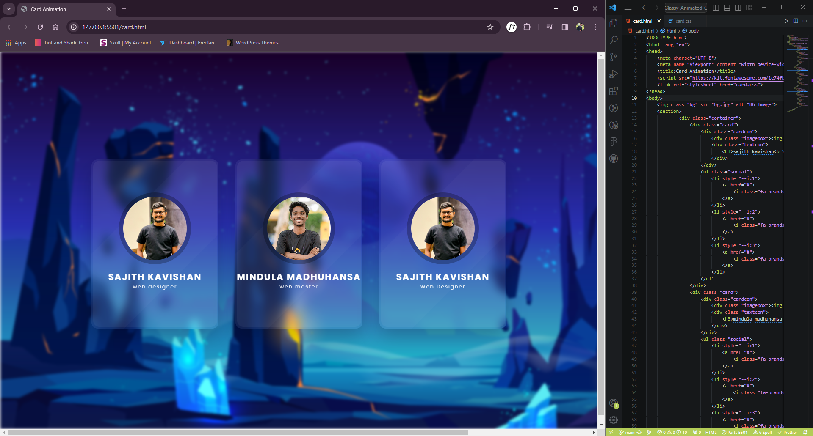

# Responsive Glassy Animated Cards Using HTML & CSS

Experience elegance with this glassy animated card. The responsive design showcases a mesmerizing blend of transparency and motion, creating a modern and stylish display. CSS magic at its finest!

## Features

- Responsive Design: The card is responsive, ensuring a seamless and attractive display across various screen sizes and devices.
- CSS Animation: The use of CSS animations adds a dynamic touch to the card, providing an engaging and interactive user experience.
- Modern Aesthetics: The design features a contemporary look with a glassy and translucent appearance, creating a visually appealing and modern aesthetic.
- Hover Interactivity: The card responds to user interaction, with a subtle rotation animation and changes in opacity on hover, enhancing the overall interactivity and user engagement.
- Code Organization: The CSS code is well-organized and commented, making it easy to understand and maintain.

## Demo Video

Watch our demo video to see these animations in action:

<video>Record_2024_01_18_17_36_04_494.mp4<video/>

## Community

Join our community of designers and developers to share insights and contributions. We value your feedback and ideas for improvements.

## Connect with Us

Follow us on GitHub for updates. Connect with us on 

LinkedIn - www.linkedin.com/in/sajith-kavishan-948005273

Thank you for choosing our repository. Let's transform your app's introduction with stunning logo animations!
